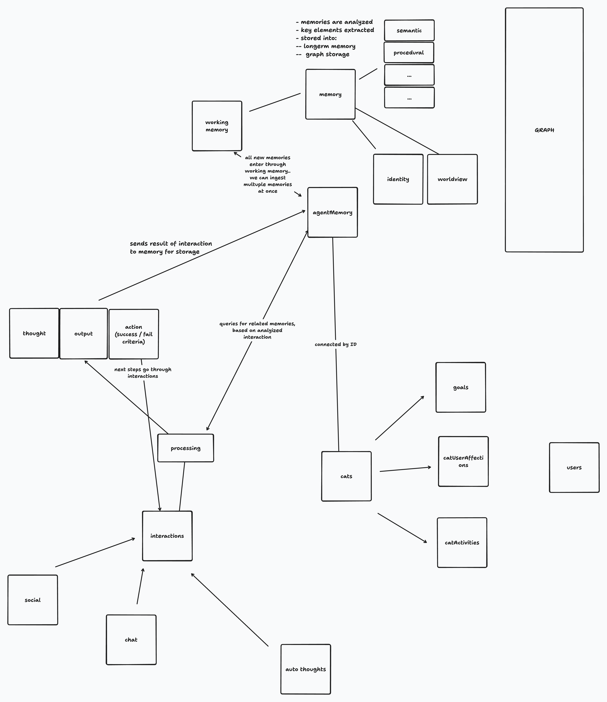

# 🐱 Misha - AI Cat Companion

Misha is an interactive AI cat companion that you can chat with, feed, and care for. It combines natural language processing with virtual pet mechanics to create an engaging and personalized experience.

## ✨ Features

- 💬 Natural conversation with your AI cat companion
- 🍣 Feed and take care of your virtual pet
- 🎮 Interactive animations and responses
- 🏪 In-game shop for items and treats
- 💰 Virtual wallet system

## 🚀 Getting Started

### Prerequisites

- Node.js (v16 or higher)
- pnpm
- Docker (for local development)

### Local Development Setup

1. Install dependencies:

```sh
pnpm install
```

2. Start the infrastructure (database and Redis):

```sh
pnpm run infra:dev
```

3. Set up environment variables:
   - Copy `.env.example` to `.env` in both `apps/frontend` and `apps/api` directories
   - Configure the necessary environment variables

## 🏗️ Architecture

View our system architecture diagram:
[System Design Diagram](https://www.tldraw.com/r/rAhi4BAZl-hfF1B44cnHk?d=v-1148.-1126.4471.2479.page)

## 📝 TODO

- [ ] Implement balance notification system
  - Show notifications when users don't have enough balance for actions (chat, feed, pet, buy items)
- [ ] Add more interactive features
- [ ] Expand shop inventory

## 🤝 Contributing

Contributions are welcome! Please feel free to submit a Pull Request.

## 📄 License

[Add your license information here]


